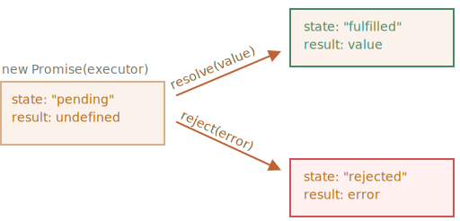

# Веб-розробка - Async JS

https://uk.javascript.info/async
https://uk.javascript.info/error-handling

## Вступ

1. Лектор запитує, як пройшов перший тиждень навчання, і отримує відповідь за допомогою «Ментиметра» або просто в чаті.
2. Лектор описує план заняття:
- `Формат`: приклади кодування в реальному часі.
- `Тривалість`: до 1,5 годин, з 5-хвилинною перервою посередині.
- `Питання`: пишіть свої запитання в чат зустрічі під час сесії, лектор відповість на них під час сесії.
- `Домашнє завдання/практичне завдання`: наприкінці заняття ми поговоримо про практичне завдання, представимо та відповімо на запитання, пов’язані з ним.

## 1. Тест у Mentimeter на тему:

Ми починаємо з тесту, щоб зрозуміти, чи вони вже щось навчилися/знають.

**Ви можете знайти тест Mentimeter тут:**

https://www.mentimeter.com/app/presentation/

**Умовні позначки:**

- ✅: правильна відповідь
- [необов’язково]: необов’язкова тема, запитання або приклад коду. Це залежить від відповідей учнів, та кількості доступного часу.

**Питання:**

1. Скільки черг для завдань (тасок) у циклі подій браузера?

- ✅: Два: для макрозадач і мікрозадач.
- Тільки один, все до нього йде.
- Три: для таймерів, отримання дзвінків і обіцянок.

2. Що може бути причиною «зависання» сторінки в браузері?

- ✅: сценарій JavaScript, що споживає процесор.
- Виклик сервера API Fetch, який займає надто багато часу.
- Дві маленькі асинхронні функції в черзі циклу подій.
- Таймери більше 10 секунд.

3. Чи надходять Promises та Timers до однієї черги циклу подій?

- Так, мають. Вони обидва асинхронні дії.
- ✅: Ні, Promises йдуть до мікрозавдань, а таймери йдуть до макрозадач.

4. Як перехопити помилку в Promise?
- ✅: передати функцію обробки помилок у `.catch`.
- ✅: передати функцію обробки помилок як другий параметр `.then`.
- Вам не потрібно виявляти помилки, браузер обробляє їх за вас.

5. Що відбувається з Promise, яку повертає `Promise.all([promise1, promise2, promise3])`, коли одна з переданих промісів переходить у "відхилений стан"?

- ✅: він переходить у стан «відхилено» та ігнорує решту.
- Ігнорує «відкинуту» обіцянку та показує результати решти.
- Нічого не відбувається, і він назавжди залишається в стані очікування.

6. Де можна використовувати "await"?
- У будь-якому сценарії.
  — Лише в сценаріях із режимом «use strict».
- ✅: у функціях з "async".
- ✅: на верхньому рівні модуля.

## 2. Теоретичні теми

### 1. Цикл подій

Лектор розповідає про цикл подій. Тут ви можете знайти основну інформацію.
Також ви можете скористатися цією статтею: [Цикл подій: мікрозавдання та макрозавдання](https://javascript.info/event-loop)

Концепція циклу подій дуже проста. Існує нескінченний цикл, у якому механізм JavaScript чекає на завдання, виконує їх, а потім перебуває в режимі сну, чекаючи нових завдань.

Загальний алгоритм роботи двигуна:

Поки є завдання:
виконуйте їх, починаючи з найстарішого завдання.
Спіть, доки не з’явиться завдання, а потім перейдіть до 1.
Це формалізація того, що ми бачимо під час перегляду сторінки. Механізм JavaScript здебільшого нічого не робить, він запускається, лише якщо активується сценарій/обробник/подія.

Приклади завдань:

- Коли завантажується зовнішній сценарій <script src="...">, завдання полягає в тому, щоб виконати його.
- Коли користувач рухає мишею, завдання полягає в тому, щоб відправити подію mousemove і виконати обробники.
- Коли настає час для запланованого setTimeout, завдання полягає в тому, щоб запустити його зворотний виклик.
  …і так далі.
- Завдання встановлюються – механізм обробляє їх – потім чекає на інші завдання (під час сну та споживаючи майже нуль ЦП).

Може трапитися так, що завдання приходить, коли движок зайнятий, а потім воно ставиться в чергу.

Завдання утворюють чергу, так звану «чергу макрозадач» (термін v8):

Ілюстрація для демонстрації: <https://javascript.info/article/event-loop/eventLoop.svg>


### 2. Завдання, що потребують процесора

Перейдіть до прикладу зі статті, запустіть приклад і покажіть, як все зависає.

[Завдання, які потребують CPU](https://javascript.info/event-loop#use-case-1-splitting-cpu-hungry-tasks)

### 3. Таймери

> **ПИТАННЯ**: Які функції таймерів ви знаєте?

```html
<h1>The best website ever.</h1>
```

```css
.modal {
  position: absolute;
  top: 50%;
  left: 50%;
  padding: 20px;
  transform: translateX(-50%) translateY(-50%);
  border: 2px solid;
  background-color: #fff;
}

.modal__backdrop {
  position: absolute;
  top: 0;
  left: 0;
  width: 100%;
  height: 100%;
  background-color: rgba(0, 0, 0, 0.3);
}
```

```js
console.clear();

function showModal() {
  let element = document.querySelector("body");
  let customModal = `
    <div class="modal__backdrop"></div>
    <div class="modal">
      <h2>Hello, user! Do you want to subscribe for our updates?</h2>
    </div>
  `;

  element.insertAdjacentHTML("afterbegin", customModal);
}

// 1. setTimeout
let timer = setTimeout(showModal, 1000);
// clearTimeout(timer); // Cancels Timer

// 2. setInterval
let i = 0;
let interval = setInterval(() => {
  i++;

  console.log(i);

  if (i === 3) {
    clearInterval(interval);
  }
}, 1000);

// clearInterval(interval); // Cancels Interval
```

#### 3.1 Завдання таймерів

> **ПИТАННЯ**: Яким буде порядок у консолі?

```js
console.clear();

// Яким буде порядок у консолі?

/*
console.log(1);
setTimeout(() => console.log(2), 1);
setTimeout(() => console.log(3), 0);
console.log(4);
*/
```

7. **Опис вимог до практичного завдання.** Подробиці дивіться в [DISCLAIMER.md](../DISCLAIMER.md).

### 4. Promises

**Promise** -- це спеціальний об’єкт для async дії.
Він може мати 3 різні стани

Оригінальне посилання: <https://javascript.info/article/promise-basics/promise-resolve-reject.svg>


```js
console.clear();

let url = "https://date.nager.at/api/v3/PublicHolidays/2023/ua";

// Обіцянки були введені для вирішення так званого "зворотного пекла"
// Ви можете дізнатися про "callback hell" тут: http://callbackhell.com/
// Основним випадком використання промісів є вибірка.
// Усі виклики вибірки повертають обіцянки
let promise = fetch(url);

// Promise дозволяє працювати з результатом виклику за допомогою then методу
promise
 .then((response) => response.json()) // Кожен then повертає NEW PROMISE
 .then((result1) => console.log(result1.length)) // Зворотний виклик у наступному "then" отримує повернуте значення з "попереднього then"
 .then((результат2) => console.log(результат2)); // Якщо зворотний виклик у «previous then» повертає нову обіцянку, ми отримуємо його дозволене значення в «the next then»

console.log("Я synchronius, тому ви бачите мене раніше");
```

### 5. Обробка помилок Promises

```js
console.clear();

let badUrl = "SOME_BAD_URL";
let goodUrl = "https://date.nager.at/api/v3/PublicHolidays/2023/ua";

class SomeCoolError extends Error {}

console.log("Loading...");

let promise = fetch(badUrl)
 .then((response) => response.json()) // Помилка! Ми не можемо отримати результат у форматі JSON, оскільки ми не змогли здійснити виклик сервера
 .then((result) => console.log("You don't see this log, because of error")) // це "then" не викликається
 .catch((помилка) => {
   console.log("Error:", error.name); // Виловлюємо помилку в першому "catch"
 // Крім того, ми можемо передати другий зворотний виклик у «then», він робить те саме

 if (error.nbme !== "SyntaxError") {
 // Якщо ми не можемо впоратися з цією помилкою, ми кидаємо її далі, і її можна зловити, купивши інший «улов»
   throw error;
 }

   return 777; // Це значення ми отримуємо в наступному "тоді"
 })
 .then((data) => console.log("then after catch:", data)) // "then" після "catch" викликається, якщо "catch" не викликає жодних помилок і просто повертає щось
 .finally(() => console.log("finally")); // Цей завжди виконується
```

### 6. Try...catch

Він нам знадобиться, коли будемо говорити про `async...await`

```js
console.clear();

try {
  console.log(someVarWithNoDeclaration);
} catch (error) {
  console.warn("Oops:", error.message, error.stack);
}

console.log("Code after an error!");

try {
  console.log("Code without errors");
} catch (error) {
  console.log("This code is ignored: no errors");
}

function someFunctionWithError() {
  throw new Error("I AM ERROR!");
}

try {
  someFunctionWithError();
} catch (error) {
  console.warn(error.message);
} finally {
  console.log("FinallY: We always see this message!");
}

let json = '{"name": "Boris"}';
let user = JSON.parse(json);

let user1;
try {
  let badUserJson = "{ Boris }";
  user1 = JSON.parse(badUserJson);
} catch {
  user1 = null;
}

console.log("Code which works with user", user1);
```

### 7. Promise.resolve, Promise.reject, Promise.all, Promisification

```js
console.clear();

// Promise Resolve
let resolvedPromise = Promise.resolve("Some Value");
resolvedPromise.then((value) => console.log(`Resolved with: ${value}`));

// Promise reject
let rejectedPromise = Promise.reject(new Error("Some Error"));
rejectedPromise
 .then((value) => console.log(`Resolved with: ${value}`)) // Ми цього не бачимо
 .catch((error) => console.log(`Rejected Promise Error: ${error}`));

// Promise All
let promise1 = Promise.resolve("Value1");
let promise2 = Promise.resolve("Value2");
let promise3 = Promise.resolve("Value3");

let promises = [promise1, promise2, promise3 /*rejectedPromise*/]; // Це не вдається, якщо принаймні одна обіцянка відхилена
let promiseall = Promise.all([promise1, promise2]).then((result) => {
 console.log(результат); // Ми отримуємо масив розв’язаних значень, коли всі обіцянки вирішено
});

// Обіцянка
// Ми можемо обернути будь-яку асинхронну дію обіцянкою
let timerPromise = new Promise((resolve, reject) => {
 // Ми викликаємо «resolve», якщо хочемо вирішити promise
 // Ми викликаємо «reject», якщо хочемо відхилити обіцянку
 // Як тільки обіцянка змінює свій стан, вона стає постійною
  setTimeout(() => resolve("Ready!"), 3000);
});


timerPromise.then((result) => console.log(result)); // Готово за 3 секунди
```

### 8. Async/wait

У сучасній розробці більшість часу ми використовуємо `async/await`. Давайте розберемося, як з ним працювати.

```js
console.clear();

let BAD_URL = "BAD_URL";

const emptyAsyncFunction = async () => {
  return 999;
};

// Коли ми додаємо "async", функція починає автоматично повертати обіцянку
emptyAsyncFunction().then((result) => console.log(result)); // Тут ми отримуємо "undefined", якщо функція не повертає певне значення


async function fetchData() {
  let url = "https://date.nager.at/api/v3/PublicHolidays/2023/ua";

  let serverData;
  try {
 // Ми можемо використовувати "await" лише у функціях з "async"
 let response = await fetch(url); // "чекати" в основному "розгортає" обіцянку
 // Це дозволяє нам працювати з промісами, як зі звичайним кодом synchronios
 // Але це не блокує інтерфейс і не змушує веб-сайт зависати
 // Це лише покращує наш код

 /*
 // Розкоментуйте це, щоб отримати помилку в catch
    let response2 = await fetch(BAD_URL);
    let response2JSON = await response2.json();
    */

 // Ми можемо використовувати скільки завгодно "await".
    serverData = await response.json();

 // Ми можемо просто розмістити будь-яке значення з іншого боку від "await"
 // Але це має сенс тільки з обіцянками
    let value = await (5 + 4 + 11);
    console.log(`Value from primitive: ${value}`);
  } catch (error) {
 // Ми виявляємо помилки обіцянок за допомогою try...catch
    console.log("Show error caught by try..catch:", error.message);
  }

  return serverData;
}

fetchData().then((res) => console.log(res.length));
```
